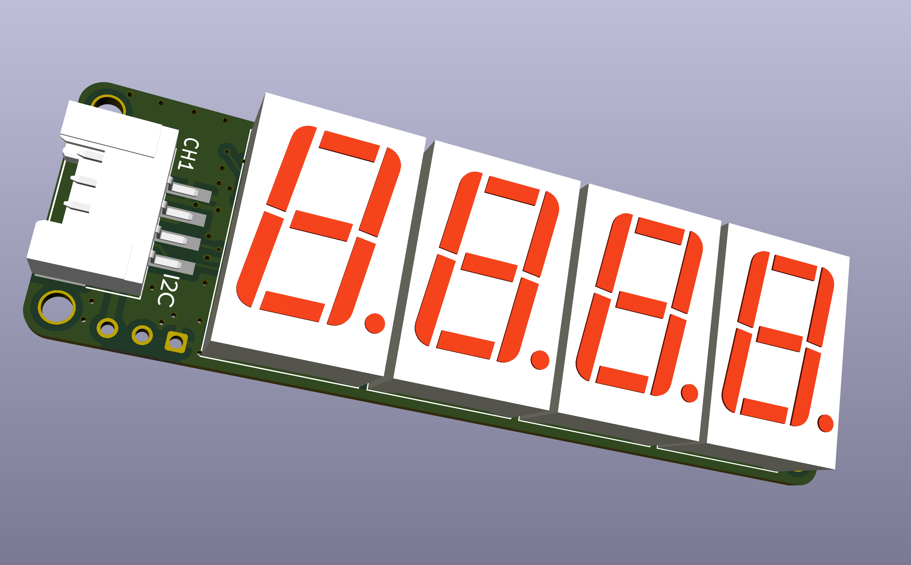
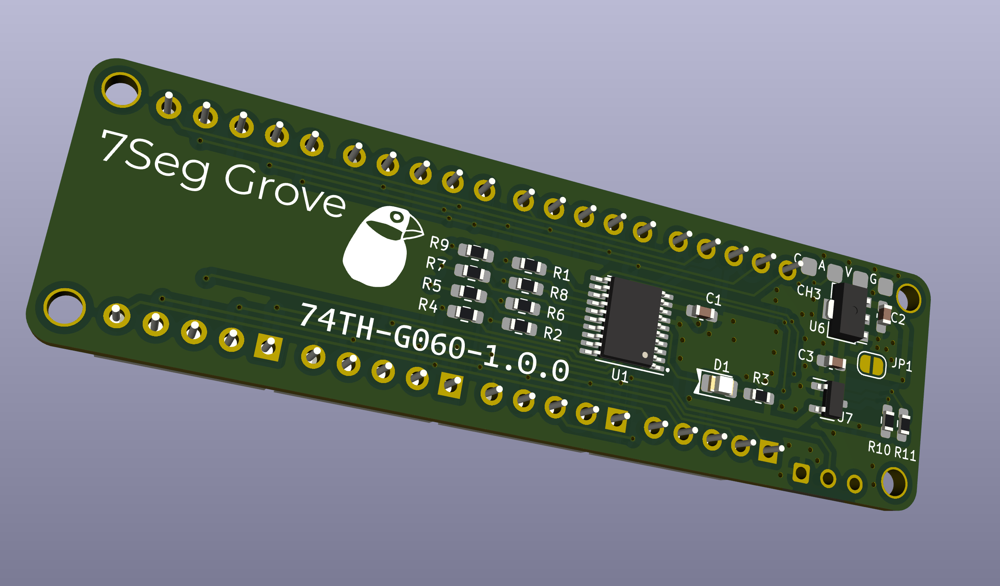

# 7Seg Grove

This module allows you to control four 7-segment LEDs using I2C signals through a Grove connector.

> [!Caution]
> WIP





- Semantics: [kicanvas](https://kicanvas.org/?github=https%3A%2F%2Fgithub.com%2F74th%2F74th-oshw-projects%2Fblob%2Fmain%2F74TH-G060-7seg-grove%2F74TH-G060-7seg-grove.kicad_sch)
- PCB: [kicanvas](https://kicanvas.org/?github=https%3A%2F%2Fgithub.com%2F74th%2F74th-oshw-projects%2Fblob%2Fmain%2F74TH-G060-7seg-grove%2F74TH-G060-7seg-grove.kicad_pcb)
- Firmware: [./firmware (using ch32v003fun)](./firmware)

## I2C Protocol

- Address: 0x73

### Registers

| address |                                                     | R/W | reset |
| ------- | --------------------------------------------------- | --- | ----- |
| 0x00    | Direct IO for LED 1                                 | R/W | 0x00  |
| 0x01    | Direct IO for LED 2                                 | R/W | 0x00  |
| 0x02    | Direct IO for LED 3                                 | R/W | 0x00  |
| 0x03    | Direct IO for LED 4                                 | R/W | 0x00  |
| 0x10    | Number uint16 input(Upper bit) (Not Impremented)    | W   | 0x00  |
| 0x11    | Number uint16 input(lower bit) (Not Impremented)    | W   | 0x00  |
| 0x12    | Point location(0x00 is OFF)       (Not Impremented) | W   | 0x00  |
| 0x20-26 | Charactor input (Not Impremented)                   | W   | 0x00  |

#### Direct IO bits

- bit 1: LED A(1: ON, 0: OFF)
- bit 2: LED B(1: ON, 0: OFF)
- bit 3: LED C(1: ON, 0: OFF)
- bit 4: LED D(1: ON, 0: OFF)
- bit 5: LED E(1: ON, 0: OFF)
- bit 6: LED F(1: ON, 0: OFF)
- bit 7: LED G(1: ON, 0: OFF)
- bit 8: LED DP(1: ON, 0: OFF)


#### Character strings allowed in Charactor input

```
0123456789-_
```